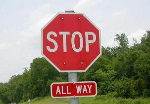
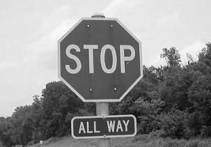
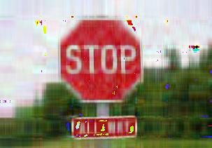
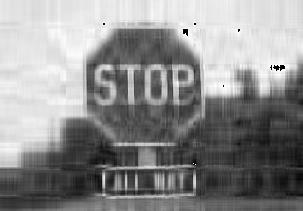

Japanese/ [English](README.md)

# 特異値分解による画像の低ランク近似

## 内容

画像をそのまま行列だと思って特異値分解し、指定したランクで近似した画像を作成するPythonスクリプト。元の画像からグレースケール画像も作り、カラーと白黒双方で近似画像を作る。

## 使い方

```
$ python image_svd.py ファイル名 ランク
```

## サンプル

```
$ python image_svd.py stop.jpg 10
Saved as stop_r10_mono.jpg
Saved as stop_r10.jpg
```

入力画像 (Original)



グレースケール画像 (入力画像から自動で作成)



近似画像 (カラー, Rank=10)



近似画像 (白黒, Rank=10)


